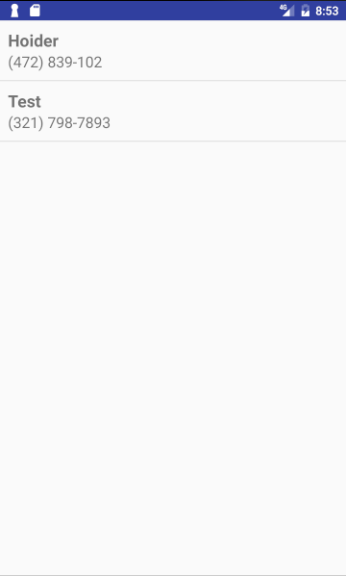

# Android certificate preparation

* [1. Fundamental Application Components][1]
  * [1a. Describe an application's key functional and nonfunctional requirements][1a]
  * [1b. Create an Activity that displays a layout resource][1b]
  * [1c. Fetch local data from disk using a Loader on a background thread][1c]
  * [1d. Propagate data changes through a Loader to the UI][1d]
  * [1e. Schedule a time-sensitive task using alarms][1e]
  * [1f. Schedule a background task using JobScheduler][1f]
  * [1g. Execute a background task inside of a Service][1g]
  * [1h. Implement non-standard task stack navigation (deep links)][1h]
  * [1i. Integrate code from an external support library][1i]

* [2. Application User Interface (UI) and User Experience (UX)][2]
  * [2a. Mock up the main screens and navigation flow of the application][2a]
  * [2b. Describe interactions between UI, background task, and data persistence][2b]
  * [2c. Construct a layout using XML or Java code][2c]
  * [2d. Create a custom view class and add it to a layout][2d]

* [3. Persistent Data Storage][3]
  * [3a. Define a database schema; include tables, fields, and indices][3a]

* [4. Testing and Debugging][4]
  * [4a. Write and execute a local JVM unit test][4a]
  * [4b. Write and execute a device UI test][4b]
  * [4c. Given a problem description, replicate the failure][4c]
  * [4d. Use the system log to output debug information][4d]
  * [4e. Debug and fix an application crash (uncaught exception)][4e]
  * [4f. Debug and fix an activity lifecycle issue][4f]
  * [4g. Debug and fix an issue binding data to views][4g]

## 1. Fundamental Application Components
Understanding of Android's top-level application components (Activity, Service, Broadcast Receiver, Content Provider) and the lifecycle associated with each one. Candidates should be able to describe the types of application logic that would be best suited for each component, and whether that component is executing in the foreground or in the background. This includes strategies for determining how and when to execute background work.

### 1a. Describe an application's key functional and nonfunctional requirements
A functional requirement describes what a software system should do, while non-functional requirements place constraints on how the system will do so.

**Functional requirement example**: When a user registers, the system should send an email confirming their registration

**Non-functional requirement example**: Registration confirmation email should be sent within 30 seconds of registration

### 1b. Create an Activity that displays a layout resource
Activites are interactive windows that can either be displayed fullscreen, floating or integrated into other activities.

***The bare minimum of creating an Activity and displaying a layout:***

```java
package com.somesite.somecompany.appname.activities;

import android.app.Activity;
import android.os.Bundle;
import com.somesite.somecompany.appname.R;

public class BasicActivity extends Activity{
    @Override
    protected void onCreate(Bundle savedInstanceState) {
        super.onCreate(savedInstanceState);
        setContentView(R.layout.activity_basic);
    }
}
```

Read more about Activities on [Androids Activity Documentation][1ba] and about their lifecycle at [Android Activity Lifecycles Documentation][1bb]

### 1c. Fetch local data from disk using a Loader on a background thread
Loaders lets you load data from either Content Providers or other data sources. They are available to every Activity and Fragment, and conforms to their respective lifecycles such as onDestroy(). Loaders also observe datasources, so that they can update the UI when the underlying datasource changes. Another important thing about Loaders is that they can cache the data they fetch, making multiple visits to an Activity or Fragment more smooth as the user do not have to wait for another data fetch.

This project contains a barebones implementation of a Loader. [LoaderExampleActivity.java][1ca] loads [activity_loader_example.xml][1cb] which only contains a Fragment. This Fragment space loads [ContactLoader.java][1cc] that loads Contacts from the phone with a Loader. Once the Loader is complete it puts the returned information into [listitem_contacts][1cd] that are items displayed in [listview_contacts][1ce]. Resulting in this:



***Note:*** This example is running on main thread, see [section 1f.][1f] for a background thread example.

Read more about Loaders on [Androids Loaders Documentation][1cf]

### 1d. Propagate data changes through a Loader to the UI
Propagating data with a Loader is explained and illustrated under [section 1c.][1c]

### 1e. Schedule a time-sensitive task using alarms
Alarms are used to send a Broadcast at a certain point in time. The Broadcast is picked up by a Receiver, that will perform a given task, such as sending a Notification to the device.

This project contains an implementation of an Alarm that sends a Notification at a point in time. [AlarmScheduleManager.java][1ea] starts an Alarm that triggers a Broadcast after 15 seconds. [AlarmReceiver.java][1eb] receives this Broadcast and sends a Notification to the user. When the Notification is tapped, [AlarmWakeActivity.java][1ec] is started.

Read more about Alarms on [Android AlarmManager Documentation][1ed]

### 1f. Schedule a background task using JobScheduler
JobScheduler is similar to Alarms in the sense that both are used to schedule tasks, however, Alarms are used to trigger task at a specified time. JobScheduler can be used to schedule tasks when a certain device state condition is met, such as when the network is online again. Can also be used for periodically tasks, and most importantly, can persist through device reboot.

This project contains an implementation of JobScheduler that will only start if a network condition is met (needs to have a network connection). If said condition is not met, the Job will not run.

[JobSchedulerExampleActivity.java][1fa] will start a Job and register a BroadcastReceiver so it knowns when the Job has finished. The Job is handled by [JobScheduleService.java][1fb] which will execute a background task, which in return will Broadcast its result.

To test this scenario properly, try to open [JobSchedulerExampleActivity.java][1fa] with, and without an active network connection to see the difference in results.

Read more about JobScheduler at [Android JobScheduler Documentation][1fc] and [Android JobInfo Documentation][1fd]

### 1g. Execute a background task inside of a Service
Executing a background task inside of a Service is explained and illustrated under [section 1f.][1f]

### 1h. Implement non-standard task stack navigation (deep links)
Deep-linking enables other means of opening your application, such as from a website or another application. Setting up deep-links on its own is done purely in the manifest with an intent-filter.

```xml
  <activity android:name=".MainActivity">
        <intent-filter>
            <action android:name="android.intent.action.MAIN" />
            <category android:name="android.intent.category.LAUNCHER" />
            <action android:name="android.intent.action.VIEW" />
            <category android:name="android.intent.category.DEFAULT" />
            <category android:name="android.intent.category.BROWSABLE" />

            <data android:scheme="example"
                android:host="androidcert" />
        </intent-filter>
    </activity>
```

Now this can easily be tested through the terminal:
```
adb shell am start -W -a android.intent.action.VIEW -d <URI> <PACKAGE>
```

Opening the app this way, you can pass params to an Intent that the app can read. If we did something like example://androidcert?activity=AnotherActivity, we could read the ?activity part and redirect the user further inside the application.

An app can open other apps this way, for example the phone app:
```java
Uri number = Uri.parse("tel:5551234");
Intent callIntent = new Intent(Intent.ACTION_DIAL, number);
```

Read more about deep-linking at [Android deep-linking Documentation][1ha]

### 1i. Integrate code from an external support library
Read about [gradle dependencies][1ia]

***Note:*** This project builds with [the Jack Toolchain][1ib] to support `Java 1.8` functionality.

## 2. Application User Interface (UI) and User Experience (UX)
Implementation of the visual and navigational components of an application's design. This includes constructing layouts–using both XML and Java code–that consist of the standard framework UI elements as well as custom views. Candidates should have a working knowledge of using view styles and theme attributes to apply a consistent look and feel across an entire application. Understanding of how to include features that expand the application's audience through accessibility and localization may also be required.

### 2a. Mock up the main screens and navigation flow of the application
Read about [Androids Wireframe Documentation][2aa]

### 2b. Describe interactions between UI, background task, and data persistence
Read about [Androids Wireframe Documentation][2aa]

### 2c. Construct a layout using XML or Java code
Read about [Androids Layout Documentation][2ca] and see example in [activity_main.xml][2cb]

### 2d. Create a custom view class and add it to a layout
To create a custom view, you have to extend the View Class, or any existing children of the View Class such as TextView. See [DiscoText.java][2da] for an example.

A View has two very important functions that should always be implemented. onDraw() will pass along a Canvas that lets you can draw elements on it, while onMeasure() will let the application know how much space the custom View should take.

Canvas Pairs well with [Paint][2de], which lets you draw lines, arcs and so on, pretty similar similar to Javascript Canvas.

Custom View's can take any number of attributes, and should be defined in [values/attrs.xml][2db], these attributes is handled by [DiscoText.java][2da] in this example. And is passed along from our layout ([activity_customview.xml][2dc]).

Read about [Androids Creating Custom Views Documentation][2dd].

## 3. Persistent Data Storage

Determining appropriate use cases for local persisted data, and designing solutions to implement data storage using files, preferences, and databases. This includes implementing strategies for bundling static data with applications, caching data from remote sources, and managing user-generated private data. Candidates should also be able to describe platform features that allow applications to store data securely and share that data with other applications in a secure manner.

### 3a. Define a database schema; include tables, fields, and indices
A schema are also used to define the structure of entire databases and the relationship between the various tables contained in each database.
E.g.:

```sql

CREATE TABLE contacts (
  id INTEGER PRIMARY KEY,
  name TEXT NOT NULL,
  phone_number TEXT NOT NULL,
);


CREATE INDEX contacts_id_idx ON contacts(id);

```

## 4. Testing and Debugging
Writing tests to verify that the application's logic and user interface are performing as expected, and executing those tests using the developer tools. Candidates should be able to analyze application crashes, and find common bugs such as layout errors and memory leaks. This includes working with the debuggers to step through application code and verify expected behavior.

### 4a. Write and execute a local JVM unit test
The most popular framework for writing test on Java is [JUnit][4aa], and is also the proposed framework by Google. JUnit requires ```testCompile 'junit:junit:4.12'``` to be defined as a dependency. And it is required to also include ```testCompile 'org.mockito:mockito-core:1.10.19'``` as a dependency if the tests requires interaction with Android dependencies.

Tests must be located at ```{module-name}/src/test/java```, and each method within the test class that should be run at testing needs to be annotated with @test. Unit tests are ment to test the applications methods, and a simple one can look something like this:

*Application file:*
```java
public class Calculator {
    static public Integer addition (Integer first, Integer second) {
        return first + second;
    }
}
```

*Test file:*
```java
import org.junit.Test;

import static org.hamcrest.CoreMatchers.is;
import static org.junit.Assert.assertThat;

public class ExampleUnitTest {

    @Test
    public void testCalculation() {
        assertThat(Calculator.addition(2, 2), is(4));
    }
}
```

See and run example in [ExampleUnitTest.java][4ab]
Read about [Androids Building Local Unit Tests Documentation][4ac] for more information

### 4b. Write and execute a device UI test
For writing UI tests Espresso is recommended by Google. Espresso tests can be both programmed, or point-to-click created. Espresso requires ```androidTestCompile 'com.android.support.test.espresso:espresso-core:2.2.2'``` to be defined as a dependency in your modules build.grade file. To record a UI test in Android Studio, simply click "Run->Record Espresso Test" in the toolbar.

See an example in [MainActivityTest.java][4ba]

Read about [Androids Testing UI for a Single App Documentation][4bb]

### 4c. Given a problem description, replicate the failure
Leaving this blank as there is not really any documentation that can be useful here. Trial and failure is the best way to get better at this.

### 4d. Use the system log to output debug information
Read about [Android Log Documentation][4da]

### 4e. Debug and fix an application crash (uncaught exception)
Fixing application crashes starts with the debugger consoler. Look for red text and the "Cause by" text, as this in almost all cases pinpoints the exact problem. Filenames marked in blue color is a good place to start with after.

### 4f. Debug and fix an activity lifecycle issue
Fixing lifecycle issues can be simplified by putting breakpoints at the start and the end of each lifecycle (e.g. onStart() and onResume()), this way you can easily pinpoint which part of the lifecycle that breaks, and go on from there.

### 4g. Debug and fix an issue binding data to views
Data binding issues are often cause by either null pointers or type mismatch. Another big offender is trying to bind data to a view before the views activity has been loaded.

[1]: #1-fundamental-application-components
[1a]: #1a-describe-an-applications-key-functional-and-nonfunctional-requirement
[1b]: #1b-create-an-activity-that-displays-a-layout-resource
[1ba]: https://developer.android.com/reference/android/app/Activity.html
[1bb]: https://developer.android.com/guide/components/activities/activity-lifecycle.html
[1c]: #1c-fetch-local-data-from-disk-using-a-loader-on-a-background-thread
[1ca]: ./AndroidCertificationPreparation/app/src/main/java/com/acp/terjelonoy/androidcertificationpreparation/activities/LoaderExampleActivity.java
[1cb]: ./AndroidCertificationPreparation/app/src/main/res/layout/activity_loader_example.xml
[1cc]: ./AndroidCertificationPreparation/app/src/main/java/com/acp/terjelonoy/androidcertificationpreparation/loaders/ContactLoader.java
[1cd]: ./AndroidCertificationPreparation/app/src/main/res/layout/listitem_contacts.xml
[1ce]: ./AndroidCertificationPreparation/app/src/main/res/layout/listview_contacts.xml
[1cf]: https://developer.android.com/guide/components/loaders.html
[1d]: #1d-propagate-data-changes-through-a-loader-to-the-ui
[1e]: #1e-schedule-a-time-sensitive-task-using-alarms
[1ea]: ./AndroidCertificationPreparation/app/src/main/java/com/acp/terjelonoy/androidcertificationpreparation/managers/AlarmScheduleManager.java
[1eb]: ./AndroidCertificationPreparation/app/src/main/java/com/acp/terjelonoy/androidcertificationpreparation/receivers/AlarmReceiver.java
[1ec]: ./AndroidCertificationPreparation/app/src/main/java/com/acp/terjelonoy/androidcertificationpreparation/activities/AlarmWakeActivity.java
[1ed]: https://developer.android.com/reference/android/app/AlarmManager.html
[1f]: #1f-schedule-a-background-task-using-jobscheduler
[1fa]: ./AndroidCertificationPreparation/app/src/main/java/com/acp/terjelonoy/androidcertificationpreparation/activities/JobScheduleService.java
[1fb]: ./AndroidCertificationPreparation/app/src/main/java/com/acp/terjelonoy/androidcertificationpreparation/services/JobSchedulerExampleActivity.java
[1fc]: https://developer.android.com/reference/android/app/job/JobScheduler.html
[1fd]: https://developer.android.com/reference/android/app/job/JobInfo.html
[1g]: #1g-execute-a-background-task-inside-of-a-service
[1h]: #1h-implement-non-standard-task-stack-navigation-(deep-links)
[1ha]: https://developer.android.com/training/app-indexing/deep-linking.html
[1i]: #1i-integrate-code-from-an-external-support-library
[1ia]: https://docs.gradle.org/current/userguide/dependency_management.html
[1ib]: https://source.android.com/source/jack.html#the_jack_toolchain
[2]: #2-application-user-interface-ui-and-user-experience-ux
[2a]: #2a-mock-up-the-main-screens-and-navigation-flow-of-the-application
[2aa]: https://developer.android.com/training/design-navigation/wireframing.html
[2b]: #2b-describe-interactions-between-ui-background-task-and-data-persistence
[2c]: #2c-construct-a-layout-using-xml-or-java-code
[2ca]: https://developer.android.com/guide/topics/ui/declaring-layout.html
[2cb]: ./AndroidCertificationPreparation/app/src/main/res/layout/activity_main.xml
[2d]: #2d-create-a-custom-view-class-and-add-it-to-a-layout
[2da]: ./AndroidCertificationPreparation/app/src/main/java/com/acp/terjelonoy/androidcertificationpreparation/customviews/DiscoText.java
[2db]: ./AndroidCertificationPreparation/app/src/main/res/values/attrs.xml
[2dc]: ./AndroidCertificationPreparation/app/src/main/res/layout/activity_customview.xml
[2dd]: https://developer.android.com/training/custom-views/index.html
[2de]: https://developer.android.com/reference/android/graphics/Paint.html
[3]: #3-persistant-data-storage
[3a]: #3a-define-a-database-schema-include-tables-fields-and-indices
[4]: #4-testing-and-debugging
[4a]: #4a-write-and-execute-a-local-jvm-unit-test
[4aa]: http://junit.org/junit4/
[4ab]: ./AndroidCertificationPreparation/app/src/test/java/com/acp/terjelonoy/androidcertificationpreparation/ExampleUnitTest.java
[4ac]: https://developer.android.com/training/testing/unit-testing/local-unit-tests.html#build
[4b]: #4b-write-and-execute-a-device-ui-test
[4ba]: ./AndroidCertificationPreparation/app/src/androidTest/java/com/acp/terjelonoy/androidcertificationpreparation/MainActivityTest.java
[4bb]: https://developer.android.com/training/testing/ui-testing/espresso-testing.html
[4c]: #4c-given-a-problem-description-replicate-the-failure
[4d]: #4d-use-the-system-log-to-output-debug-information
[4da]: https://developer.android.com/reference/android/util/Log.html
[4e]: #4e-debug-and-fix-an-application-crash-uncaught-exception
[4f]: #4f-debug-and-fix-an-activity-lifecycle-issue
[4g]: #4g-debug-and-fix-an-issue-binding-data-to-views
